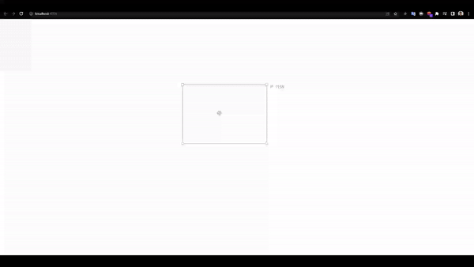

# Resizable-rectangle-INTUS

**INTUS Windows homework task**

_How to run the app locally:_

1. navigate to ./backend directory:

2. open Resizable-rectangle-be-INTUS.sln in your IDE, for example, visual studio
3. run the app, it should successfully start and open Swagger in a new tab

4. navige to ./frontend directory:

5. make sure you have [nodejs](https://nodejs.org/en/) installed and run -

```bash
npm i
```

6. make sure you have [angular-CLI](https://github.com/angular/angular-cli) installed and run -

```bash
ng serve --open
```

The app should open in a new window, it should look something like this -


